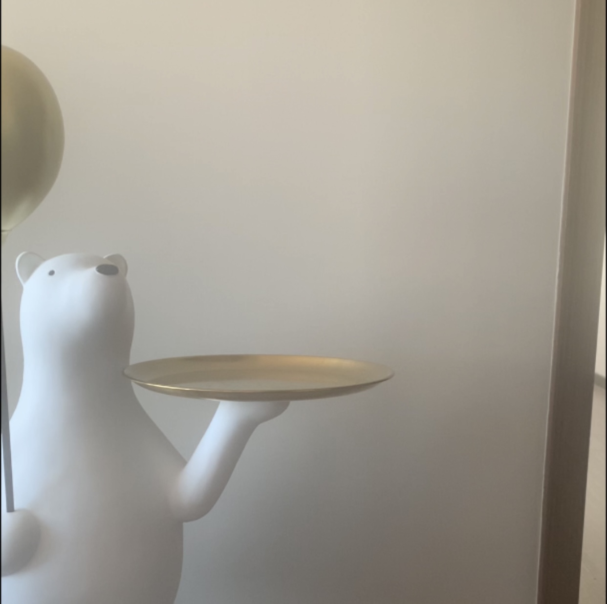
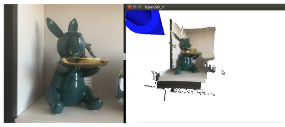

# Camera-Calibration-Reconstruct

This project implements `binocular calibration`, `stereo correction (with aberration removal)`, `stereoscopic matching`, `parallax calculation` and `depth calculation/3D coordinate calculation` for binocular cameras.

- [x] Binocular camera with single USB cable support (left and right cameras are stitched together and displayed in the same video)
- [x] Support for mono camera calibration:[mono_camera_calibration.py](mono_camera_calibration.py)
- [x] Support for binocular camera calibration:[stereo_camera_calibration.py](stereo_camera_calibration.py)
- [x] Support for filtering parallax maps with WLS filters
- [x] Support for binocular ranging (mouse click on image to get its depth distance)
- [x] Support for Open3D and PCL point cloud display

## 1.Catalog structure

```
.
├── config       # Camera parameter files
├── core         # Camera core algorithm package
├── data         # Data collected by the camera
├── demo         # demo files
├── libs         # Third-party dependency packages
├── scripts       # scripts
│   ├── mono_camera_calibration.sh     # Monocular camera calibration scripts
│   └── stereo_camera_calibration.sh   # binocular camera calibration script
├── get_stereo_images.py                  # Capture calibration file
├── mono_camera_calibration.py            # Monocular camera calibration
├── stereo_camera_calibration.py          # binocular camera calibration
├── requirements.txt                      # Dependency packages
└── README.md

```

# 2. Environment

- Dependency packages, see [requirements.txt](requirements.txt)
- python-pcl (installing python-pcl requires a little patience，Open-3D is a good alternative)
- open3d-python=0.7.0.0
- opencv-python
- opencv-contrib-python

## 3.Binocular camera calibration and correction

#### (1) Capture the left and right views of the calibration board

```bash
bash scripts/get_stereo_images.sh
```

- Before acquiring data, adjust the camera focus to ensure that the calibration board is visible in the view as much as possible
- When acquiring a checkerboard image, the calibration plate usually takes up about 1/2 to 1/3 of the view
- It is recommended to set `detect=True` so that the checkerboard grid can be detected in real time.
- Press keyboard `s` or `c` to save the left and right view images

|left_image                        |right_image                           |
|:--------------------------------:|:------------------------------------:|
||   |

#### (2) [Mono camera calibration](scripts/mono_camera_calibration.sh)

- `bash scripts/mono_camera_calibration.sh`
- If the error is more than 0.1, it is recommended to readjust the camera and calibrate it

```bash
#!/usr/bin/env bash

image_dir=data/lenacv-camera # Checkerboard image
save_dir=configs/lenacv-camera # Save calibration results
width=8
height=11
square_size=20 #mm
image_format=png # Image format，如png,jpg
show=True # Whether to show the test results
# left camera calibration
python mono_camera_calibration.py \
    --image_dir  $image_dir \
    --image_format $image_format  \
    --square_size $square_size  \
    --width $width  \
    --height $height  \
    --prefix left  \
    --save_dir $save_dir \
    --show $show

# right camera calibration
python mono_camera_calibration.py \
    --image_dir  $image_dir \
    --image_format  $image_format  \
    --square_size $square_size  \
    --width $width  \
    --height $height  \
    --prefix right  \
    --save_dir $save_dir \
    --show $show
```

After execution, the `left_cam.yml` and `right_cam.yml` left and right camera parameter files will be generated in the `$save_dir` directory

#### (3) [binocular camera calibration](scripts/stereo_camera_calibration.sh)
- `bash scripts/stereo_camera_calibration.sh`
- If the error is more than 0.1, it is recommended to readjust the camera and calibrate it

```bash
image_dir=data/lenacv-camera # Checkerboard image
save_dir=configs/lenacv-camera # Save calibration results
width=8
height=11
square_size=20 #mm
image_format=png # 图片格式，如png,jpg
#show=True # Whether to show the test results
show=False # Whether to show the test results
# stereo camera calibration
python stereo_camera_calibration.py \
    --left_file $save_dir/left_cam.yml \
    --right_file $save_dir/right_cam.yml \
    --left_prefix left \
    --right_prefix right \
    --width $width \
    --height $height \
    --left_dir $image_dir \
    --right_dir $image_dir \
    --image_format  $image_format  \
    --square_size $square_size \
    --save_dir $save_dir 
```

After execution, the `left_cam.yml` and `right_cam.yml` left and right camera parameter files will be generated in the `$save_dir` directory

## 4.disparity map and depth map

- Run the demo to calculate the disparity map and recover the depth map

|      parameters           |type    |description    |
|:-------------------:|:------:|:------|
| stereo_file    | str    | The configuration file of the binocular camera, such as "configs/lenacv-camera/stereo_cam.yml"    |
| left_video          | str    | The left camera ID or video file    |
| right_video         | str    | right_camera_id or video_file    |
| left_file           | str    | left_test_image_file    |
| right_file          | str    | right_test_image_file    |
| filter              | bool   | Whether to filter the disparity map   |

```bash
python demo.py  \
  --stereo_file "configs/lenacv-camera/stereo_cam.yml" \
  --left_video "data/lenacv-video/left_video.avi" \
  --right_video "data/lenacv-video/right_video.avi" \
  --filter True
```
- Filter the parallax map, the result will be much better

|      left_view                                       |    rightview                                                  |
|:-------------------------------------------------:|:------------------------------------------------------:|
|                       |                           |
|      **disparity(unfiltered)**                           |**depth(unfiltered)**                                                  |
|                  |                       |
|      **disparity(filtered)**                             |**depth(filtered)**                                                  |
|           |                       |

- demo

 

## 5.Binocular distance measurement

- After running `demo.py`, mouse click on any area of the image, the terminal will print the corresponding distance
- If you click on the hand area, it will print the distance from the camera about 633mm, i.e. 0.63m, which is still accurate.
```
(x,y)=(203,273),depth=633.881653mm
(x,y)=(197,329),depth=640.386047mm
(x,y)=(222,292),depth=631.549072mm
(x,y)=(237,270),depth=630.389221mm
(x,y)=(208,246),depth=652.560669mm
```

## 6.point cloud

- 3D point cloud display, using open3d
- You can use the mouse to rotate the axes and zoom in on the point cloud

  
  

## 7. References

- https://github.com/aliyasineser/stereoDepth
- <Binocular Stereo Matching for Real Scenes (Stereo Matching) to Obtain Depth Maps in Detail> : https://www.cnblogs.com/riddick/p/8486223.html
- <Binocular ranging theory and its python implementation> https://blog.csdn.net/dulingwen/article/details/98071584
- <Ubuntu 18.04 install python-pcl> https://blog.csdn.net/weixin_47047999/article/details/119088321 (tested and available)


